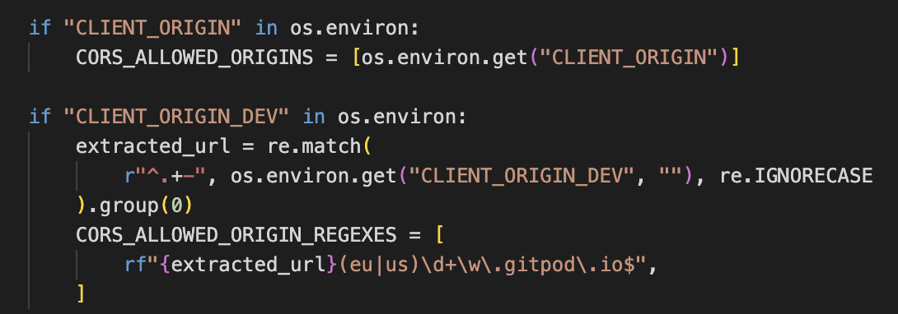

# Worldviews Backend

This is the Django backend for the Worldviews web app. Worldviews is a community for everyone who loves traveling the world. This structure makes it possible. 

The deployed backend can be found [here](https://worldviews-api1-2fa5e8a86642.herokuapp.com/).  

The live frontend site can be visited [here](https://worldviews-162453e10c7f.herokuapp.com/).

  

Entity relationship diagram created with [LucidChart](https://www.lucidchart.com/pages/).

## Table of contents
- [Intro](#worldviews-backend)
- [Table of contents](#table-of-contents)
- [Apps](#apps)
- [Development](#development)
- [Testing](#testing)
- [Technologies used](#technologies-used)
- [Deployment](#deployment)
- [Credits](#credits)

## Apps
The backend was created with 9 interconnected apps.
### Main app (drf_api)
This is the main app, which includes settings, URL paths, and authorization.
### Profiles
This app is for user profiles. The user can add a username, profile picture (avatar), and a bio.
### Followers
This app is for following other users. The number of followers/follows is counted on the user's profile.
### Posts
This app is for user-generated posts. The user can create a post with an image, title, and content. The date shows automatically.
### Comments
This app is for commenting on posts. The number of comments shows on the post.
### Likes
This app is for liking posts. The number of likes shows on the post.
### Plans
This app is for user-generated plans. The user can create a plan with a title, content, and location.
### Plan Comments
This app is for commenting on plans. The number of comments shows on the plan. It is the same as the comment app for posts, but this structure ensures that each comment shows under the correct content.
### Locations
This app is for choosing a location when creating a plan.

## Development
### User Stories
Please see the [kanban board](https://github.com/users/emilyrosenberg/projects/7/views/1). 
### Bugs
Please see the [frontend readme](hhttps://github.com/emilyrosenberg/worldviews/blob/main/README.md#bugs).

## Testing
### Manual testing
CRUD functionality was tested manually across the site.

  

### URLs Testing
All links were tested manually.

  

_Thanks to [Jody Murray's PetFriends-API](https://github.com/JodyMurray/my-api?tab=readme-ov-file#manual-testing) for inspiration about testing documentation._

## Technologies Used
### Languages
- Python
- Django
- Django Rest Framework

### Libraries, frameworks, and programs
- Django rest framework
- Django rest auth
- Django cors headers
- Django filters
- PostgreSQL (database hosting)
- Cloudinary storage (image hosting)
- Pillow (to modify images)
- Black (code formatter)
- LucidChart (to create diagrams)

Please see the [frontend readme](https://github.com/emilyrosenberg/worldviews/blob/main/README.md#languages-libraries-and-software) for other technologies used in this project.

## Deployment
### Project creation
I used the [DRF Cheat Sheet](https://docs.google.com/document/d/1v8mOyB5l7aSL5loy3MVIX4z4SsLYKe-ZEGGpT_Z5DRM/edit?pli=1#heading=h.7xtx0jslcwbv) from the walkthrough to create and deploy this project.

- Add Django rest auth library and rest framework’s authtoken
  - Install the dj-rest-auth package in the terminal  `pip install dj-rest-auth==2.1.9`
  - Add 
    `'rest_framework.authtoken'` 
    `'dj_rest_auth'` 
    to INSTALLED APPS in drf_api / settings.py
  - Add the urls to the urlpatterns list in drf_api / urls.py  
    `path('dj-rest-auth/',` 
    `include('dj_rest_auth.urls'))` 
  - Migrate the database in the terminal  `python manage.py migrate`
  
- Add the feature to register users
  - Install Django all-Auth in the terminal  `pip install 'dj-rest-auth[with_social]'`
  - Add the relevant apps to INSTALLED APPS in drf_api / settings.py 
    `'django.contrib.sites',` 
    `'allauth',` 
    `allauth.account',` 
    `'allauth.socialaccount',` 
    `'dj_rest_auth.registration',` 
  - Add SITE_ID value (place under INSTALLED APPS List)  `SITE_ID = 1`
  - Add the registration urls to the urlpatterns list in drf_api / urls.py 
    `path('dj-rest-auth/registration/',` 
    `include('dj_rest_auth.registration.urls')),`

- Add JWT tokens functionality 
  - Install the djangorestframework-simplejwt package in the terminal  `pip install djangorestframework-simplejwt==4.7.2`
  - Create a session authentication value (differentiates between Dev and Prod mode) in env.py  `os.environ['DEV'] = '1'`
  - Use Dev value above to differentiate between Dev and Prod Modes & add pagination in drf_api / settings.py, place under SITE_ID 
    

      
    

  - To enable token authentication add  `REST_USE_JWT = True`
  - To ensure tokens sent over HTTPS only add  `JWT_AUTH_COOKIE = 'my-app-auth'`
  - Declare cookie names for the access and refresh tokens add  `JWT_AUTH_SECURE = True`  
  - And  `JWT_AUTH_REFRESH_COOKIE = 'my-refresh-token'`

- Add the profile_id and profile_image to fields returned when requesting logged in user details
  - Create a new drf_api / serializers.py file
  - Import the appropriate files into drf_api / serializers.py  
  `from dj_rest_auth.serializers import UserDetailsSerializer`  
  `from rest_framework import serializers`
  - Create the profile_id and profile_image fields in drf_api / serializers.py  
   

      
    

    - Overwrite the default USER_DETAILS_SERIALIZER in drf_api / settings.py  
    `REST_AUTH_SERIALIZERS = {'USER_DETAILS_SERIALIZER': 'drf_api.serializers.CurrentUserSerializer'}`
    - Run Migrations in the terminal `python manage.py migrate`
    - Update the requirements text file `pip freeze > requirements.txt`
    - Add, commit, and push to Github

- Adding the root route
    - Create a views.py file in drf_api
    - In the file, set Imports  
      `from rest_framework.decorators import api_view`  
      `from rest_framework.response import Response`
    - Create root route and return custom message  
      

        
      

    - Set Imports in drf_api / urls.py  
    `from .views import root_route`
    - Add the url to urlpatterns list  
    `path('', root_route)`
- Adding Pagination
  - Add inside REST_FRAMEWORK drf_api / settings.py 
    `'DEFAULT_PAGINATION_CLASS':  'rest_framework.pagination.PageNumberPagination',`
    `'PAGE_SIZE': 10,`
- Add JSON renderer
  - Set JSON Renderer if Dev environment is not present 
  `if 'DEV' not in os.environ:`  
    `REST_FRAMEWORK['DEFAULT_RENDERER_CLASSES'] = ['restframework.renderers.JSONRenderer']`
- Date and time formatting - General Formatting
  - Format Date and time in REST_FRAMEWORK list in drf_api / settings.py  
  `'DATETIME_FORMAT': '%d %b %Y'`
- Date and time formatting - Comments and Posts
  - Set imports in comments / serializers.py  
  `from django.contrib.humanize.templatetags.humanize import naturaltime`
  - Set fields within the CommentSerializer class  
  `created_at = serializers.SerializerMethodField()`  
  `updated_at = serializers.SerializerMethodField()`
  - Set methods  
    `def get_created_at(self, obj):` 
    `return naturaltime(obj.created_at)` 

    `def get_updated_at(self, obj):` 
    `return naturaltime(obj.updated_at)` 
  - Add, commit, and push to Github

### Heroku deployment
Create the Heroku App with Heroku PostGres
- Log into Heroku or create an account
  - Create New App
  - Name the app (it must be unique)
  - Choose a region

- Log into ElephantSQL or create an account
  - Create New Instance
  - Name your plan (this is commonly the name of the project)
  - Select the Tiny Turtle (Free) plan
  - You can leave the Tags field blank
  - Select Region
  - Click Review
  - Check that your details are correct, then click Create Instance
  - Return to the ElephantSQL dashboard and click on the database instance name for this project
  - Copy your ElephantSQL database URL using the Copy icon. (It will start with postgres://)

- Open your App in Heroku
  - Go to the settings tab
  - Click Reveal Config Vars
  - Add a Config Var called DATABASE_URL with the value of the ElephantSQL database url you copied in the previous step

- Install and configure extra libraries
  - Install dj_database_url in the terminal  
  `pip install dj_database_url`
  - Set Import in drf_api / settings.py  
  `import dj_database_url`
  - Separate the Dev and Prod Environments
    

      
    

  - Install gunicorn in the terminal  
  `pip install gunicorn`
  - Create Procfile file in the root directory
  - In the file add code to let Heroku know how to run the project  
  `release: python manage.py makemigrations && python manage.py migrate`  
  `web: gunicorn drf_api.wsgi`
  - Set the ALLOWED_HOSTS in drf_api / settings.py  
  `ALLOWED_HOSTS = ['<YOURAPPNAME>.herokuapp.com', 'localhost']`
  - Install CORS in the Terminal  
  `pip install django-cors-headers`
  - Add to INSTALLED_APPS list in drf_api / settings.py  
    `'dj_rest_auth.registration',` 
    `'corsheaders',` 
    `'profiles',`
  - Add to MIDDLEWARE  list, at the top  
    `'corsheaders.middleware.CorsMiddleware',`
  - Set the ALLOWED_ORIGINS for the network requests made to the server
    

      
    

  - Allow Cookies  
  `CORS_ALLOW_CREDENTIALS = True`
  - Allow front end app and api be deployed to different platforms  
  `JWT_AUTH_SAMESITE = 'None'`

- Set remaining environment variables in Heroku, env.py, and settings.py
  - Set the remaining env variables in env.py  
  `os.environ['SECRET_KEY'] = '<CREATERANDOMVALUE>'`
  - Replace the ‘insecure’ key with the environment variable in drf_api / settings.py  
  `SECRET_KEY = os.environ.get('SECRET_KEY')`
  - Replace the DEBUG Setting to be only true in Dev and False in Prod Modes.  
  `DEBUG = 'DEV' in os.environ`
  - Add your config vars i.e. copy and paste values from env.py into Heroku Config Vars, e.g. CLOUDINARY_URL, SECRET_KEY
  - Add the DISABLE_COLLECTSTATIC var in Heroku  
  `DISABLE_COLLECTSTATIC = 1`
  - Update the requirements file in the terminal  
  `pip freeze > requirements.txt`
  - Add, commit, and push to Github

-  Connect the project’s Github repo to Heroku
    - Open the Deploy tab
    - Select Github as the deployment method
    - Confirm you want to connect to GitHub
    - Search for the repository name and click the connect button
    - Scroll to the bottom of the deploy page and select the preferred deployment type
    - Enable Automatic Deploys for automatic deployment when you push updates to Github
    - Open App to view the project live!

## Credits
This project was based on the Code Institute Django REST Framework walkthrough. Please see the frontend readme for [other credits](https://github.com/emilyrosenberg/worldviews/blob/main/README.md#credits)!
