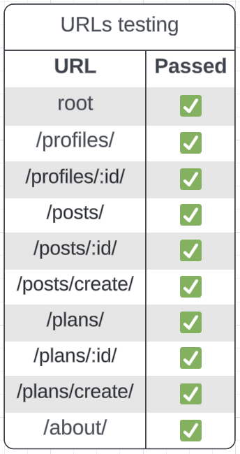

# Worldviews Backend

This is the Django backend for the Worldviews web app. Worldviews is a community for everyone who loves traveling the world. This structure makes it possible. 

The deployed backend can be found [here](https://worldviews-api1-2fa5e8a86642.herokuapp.com/).  

The live frontend site can be visited [here](https://worldviews-162453e10c7f.herokuapp.com/).

  

Entity relationship diagram created with [LucidChart](https://www.lucidchart.com/pages/).

## Table of contents
- [Intro](#worldviews-backend)
- [Table of contents](#table-of-contents)
- [Apps](#apps)
- [Development](#development)
- [Testing](#testing)
- [Technologies used](#technologies-used)
- [Deployment](#deployment)
- [Credits](#credits)

## Apps
The backend was created with 9 interconnected apps.
### Main app (drf_api)
This is the main app, which includes settings, URL paths, and authorization.
### Profiles
This app is for user profiles. The user can add a username, profile picture (avatar), and a bio.
### Followers
This app is for following other users. The number of followers/follows is counted on the user's profile.
### Posts
This app is for user-generated posts. The user can create a post with an image, title, and content. The date shows automatically.
### Comments
This app is for commenting on posts. The number of comments shows on the post.
### Likes
This app is for liking posts. The number of likes shows on the post.
### Plans
This app is for user-generated plans. The user can create a plan with a title, content, and location.
### Plan Comments
This app is for commenting on plans. The number of comments shows on the plan. It is the same as the comment app for posts, but this structure ensures that each comment shows under the correct content.
### Locations
This app is for choosing a location when creating a plan.

## Development
### User Stories
Please see the [kanban board](https://github.com/users/emilyrosenberg/projects/7/views/1). 
### Bugs
Please see the [frontend readme](hhttps://github.com/emilyrosenberg/worldviews/blob/main/README.md#bugs).

## Testing
### Manual testing
CRUD functionality was tested manually across the site.

  

### URLs Testing
All links were tested manually.

  

_Thanks to [Jody Murray's PetFriends-API](https://github.com/JodyMurray/my-api?tab=readme-ov-file#manual-testing) for inspiration about testing documentation._

## Technologies Used
### Languages
- Python
- Django
- Django Rest Framework

### Libraries, frameworks, and programs
- Django rest framework
- Django rest auth
- Django cors headers
- Django filters
- PostgreSQL (database hosting)
- Cloudinary storage (image hosting)
- Pillow (to modify images)
- Black (code formatter)
- LucidChart (to create diagrams)

Please see the [frontend readme](https://github.com/emilyrosenberg/worldviews/blob/main/README.md#languages-libraries-and-software) for other technologies used in this project.

## Deployment
I used the [DRF Cheat Sheet](https://docs.google.com/document/d/1v8mOyB5l7aSL5loy3MVIX4z4SsLYKe-ZEGGpT_Z5DRM/edit?pli=1#heading=h.7xtx0jslcwbv) from the walkthrough to deploy this project.

- Add Django rest auth library and rest framework’s authtoken
  - Install the dj-rest-auth package in the terminal `pip install dj-rest-auth==2.1.9`
  - Add `'rest_framework.authtoken'` and `'dj_rest_auth'` to INSTALLED APPS in drf_api / settings.py
  - Add the urls `path('dj-rest-auth/', include('dj_rest_auth.urls'))` to the urlpatterns list in drf_api / urls.py
  - Migrate the database in the terminal `python manage.py migrate`
  
- Add the feature to register users
  - Install Django all-Auth in the terminal `pip install 'dj-rest-auth[with_social]'`
  - Add the relevant apps to INSTALLED APPS in drf_api / settings.py `'django.contrib.sites', 'allauth', 'allauth.account', 'allauth.socialaccount', 'dj_rest_auth.registration',`
  - Add SITE_ID value (place under INSTALLED APPS List) `SITE_ID = 1`
  - Add the registration urls to the urlpatterns list in drf_api / urls.py `path('dj-rest-auth/registration/', include('dj_rest_auth.registration.urls')),`

- Add JWT tokens functionality 

## Credits
This project was based on the Code Institute Django REST Framework walkthrough. Please see the frontend readme for [other credits](https://github.com/emilyrosenberg/worldviews/blob/main/README.md#credits)!
